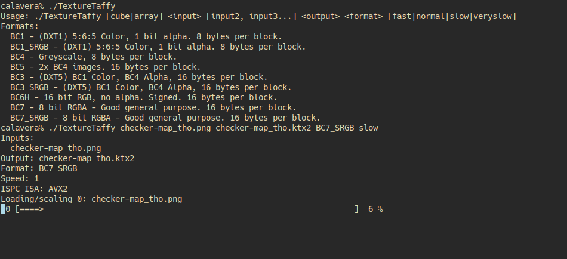

# TextureTaffy

A utility to create compressed textures, in BC1 (DXT1), BC3 (DXT5), BC4, BC5, BC6(U)H and BC7 compression formats, with the [KTX File Format Version 2.0](https://registry.khronos.org/KTX/specs/2.0/ktxspec.v2.html) (KTX2) file format.
Multithreaded, uses ispc_texcomp for compression, and stb_image for image loading.



## Requirements

* C++ compiler supporting at least c++17. Tested on GCC, clang and MSVC 2022.
* [The Meson build system](https://mesonbuild.com/)
* [Intel® Implicit SPMD Program Compiler](https://ispc.github.io/)

## Building

```
meson setup build [--buildtype=release] -Dcpp_std=c++17
meson compile -C build
```

## Usage

```
Usage: TextureTaffy [cube|array] <input> [input2, input3...] <output> <format> [fast|normal|slow|veryslow]
Formats:
  BC1 - (DXT1) 5:6:5 Color, 1 bit alpha. 8 bytes per block.
  BC1_SRGB - (DXT1) 5:6:5 Color, 1 bit alpha. 8 bytes per block.
  BC4 - Greyscale, 8 bytes per block.
  BC5 - 2x BC4 images. 16 bytes per block.
  BC3 - (DXT5) BC1 Color, BC4 Alpha, 16 bytes per block.
  BC3_SRGB - (DXT5) BC1 Color, BC4 Alpha, 16 bytes per block.
  BC6H - 16 bit RGB, no alpha. Signed. 16 bytes per block.
  BC7 - 8 bit RGBA - Good general purpose. 16 bytes per block.
  BC7_SRGB - 8 bit RGBA - Good general purpose. 16 bytes per block.
```

## Notes and limitations
* Uses stb_image for image loading. Therefore only supports radiance HDR images, not OpenEXR.
* KTX2 writer probably isn't the most robust, but it works for what I need in my pipeline.
* ispc_texcomp doesn't appear to have seperate options for encoding linear BC1, BC3 and BC7 textures. The only difference is the method I use for scaling and the format header.
Therefore the linear textures I output are probably very non-optimal. BC4/BC5/BC6 is probably best for linear data.
* Tested with LDR and HDR single images and cubemaps. May work with 3D textures and arrays, but not tested.
* Only supports BC1, BC3, BC4, BC5, BC6H and BC7 compression formats, ETC and ASTC are implemented by ispc_texcomp,
but I haven't had a need for them yet. Pull requests welcome!
* Based on my testing, the SSE4 code path is faster than AVX2 on modern AMD processors, but AVX2 is faster on intel.
from what I've read, AMD implements AVX2 in slow microcode. ISPC doesn't allow easily selecting the instruction set at runtime,
so I've added a little hack to detect AMD and use SSE4 in that case.
* Only supports x86/x64 processors. In theory ispc_texcomp has support for ARM NEON extensions for example, but I haven't had time to look at that.
